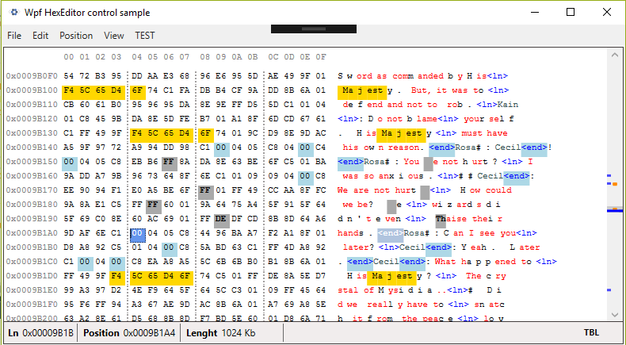
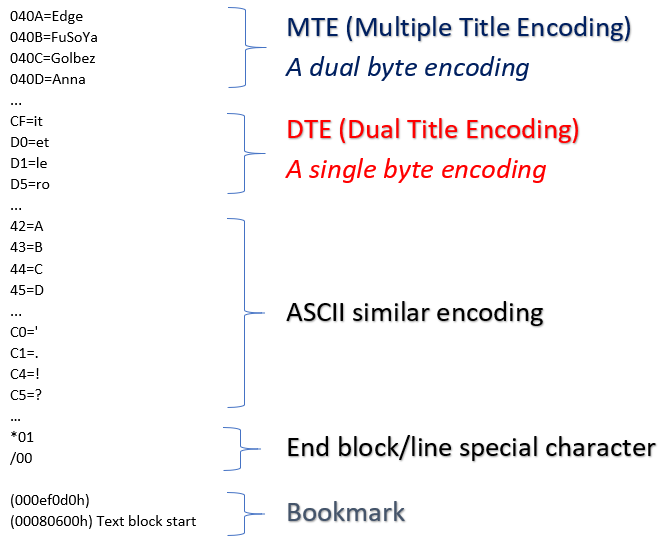
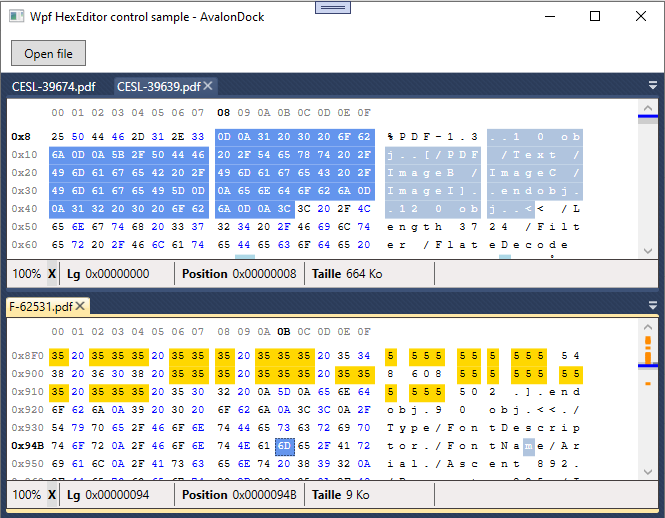
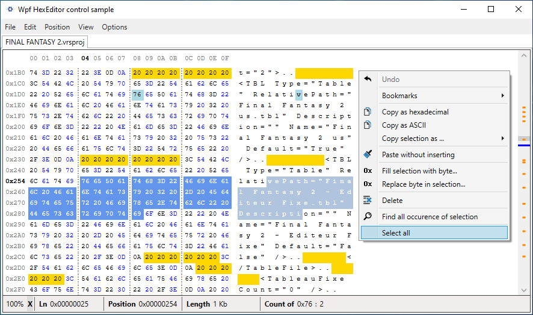
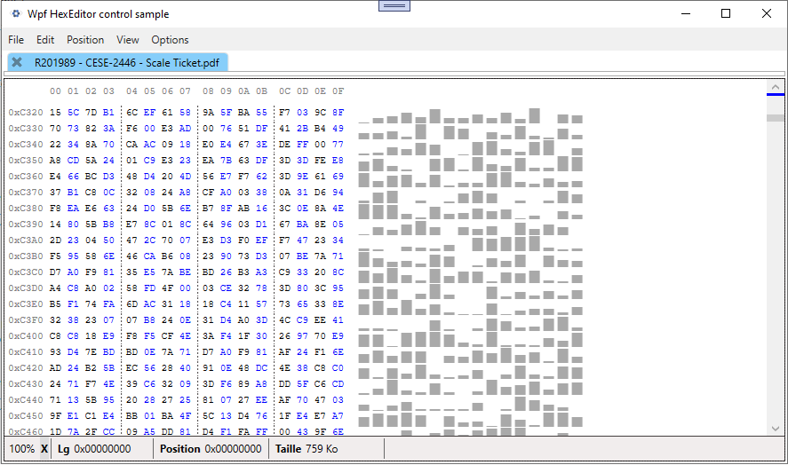
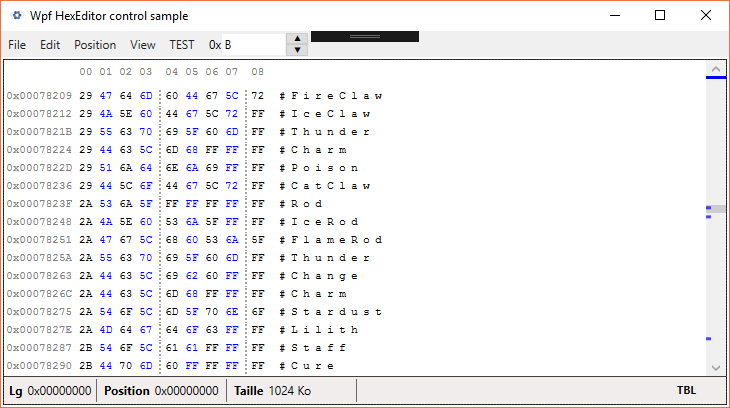
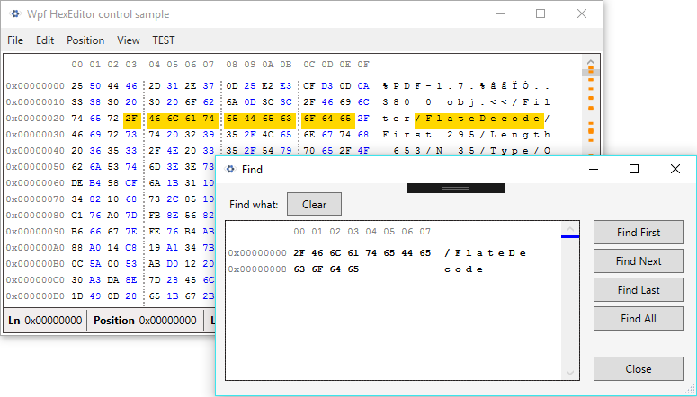
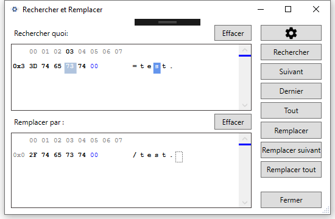
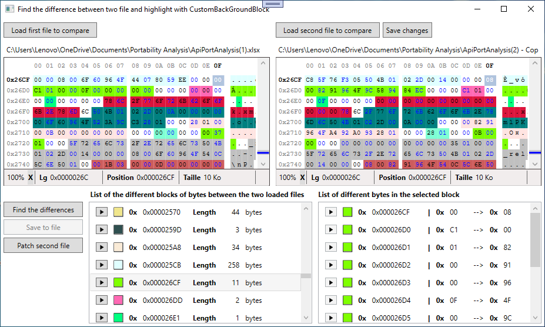
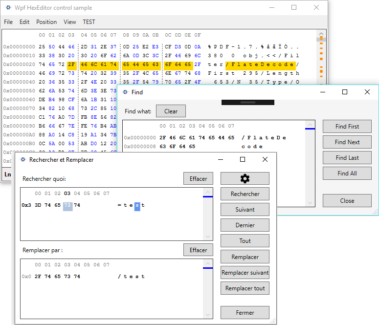

# WPF HEXEDITOR
👨‍🏫PROJETO CRIADO PARA O CURSO DE WPF.

 <br>
 <br>
 <br>
 <br>
 <br>
 <br>
 <br>
 <br>
 <br>
 <br>

## DESCRIÇÃO:
Wpf HexEditor é um controle de usuário poderoso e totalmente personalizável para editar arquivos ou streams em formato hexadecimal, decimal e binário. Você pode usá-lo facilmente em aplicações WPF ou WinForm. Baixe o código e teste os exemplos WPF (C#, VB.NET) e WinForm (C#). O controle está localizado em Inglês, Francês, Russo, Polonês, Português e Chinês.

### O QUE É TBL (TABELA DE CARACTERES PERSONALIZADA)?
Os arquivos TBL são pequenos arquivos de texto simples que ligam cada valor hexadecimal a um caractere, o que é muito útil ao ler e alterar dados de texto. O Wpf HexEditor suporta .tbl, e você pode definir sua tabela de caracteres personalizada conforme desejar.

TBLs Unicode são suportados. Para usar, coloque o valor à direita do igual (=) como (0401=塞西尔) ou (42=Д) no seu arquivo de texto simples .tbl.

## FUNCIONALIDADES:
1. **Visualização de Dados em Hexadecimal:**
   - Permite a visualização dos dados do arquivo em formato hexadecimal.
   - Mostra o conteúdo binário dos arquivos, que pode ser útil para desenvolvedores e engenheiros que precisam examinar a estrutura de arquivos binários.

2. **Edição de Dados:**
   - Possibilidade de editar os dados diretamente na visão hexadecimal.
   - Permite modificar bytes individuais ou grupos de bytes no arquivo.

3. **Codificação Múltipla:**
   - Suporte para diferentes tipos de codificação, como MTE (Multiple Title Encoding) e DTE (Dual Title Encoding).
   - Essas codificações são usadas para representar caracteres ou sequências específicas de bytes de forma mais compacta.

4. **Marcação de Blocos e Linhas:**
   - Funcionalidade para marcar blocos ou linhas específicas no arquivo.
   - Permite uma navegação mais fácil e identificação de partes importantes do arquivo.

5. **Visualização e Comparação de Arquivos:**
   - Capacidade de abrir vários arquivos ao mesmo tempo para visualização e comparação.
   - Facilita a comparação lado a lado de dois arquivos diferentes, como mostrado na terceira imagem.

6. **Codificação ASCII e Caracteres Especiais:**
   - Suporte para visualizar caracteres ASCII e outros caracteres especiais.
   - Facilita a interpretação do conteúdo textual dentro dos arquivos binários.

## RECURSOS:
- ⭐ Suporte a AvalonDock
- ⭐ Edição em hexadecimal, decimal e binário
- ⭐ Edição em 8 bits, 16 bits e 32 bits
- ⭐ Edição em LoHi ou HiLo
- ⭐ Visualização como gráfico de barras (veja na captura de tela, irá evoluir no futuro)
- ⭐ Diálogo de encontrar e substituir
- ⭐ Adicionar byte no final do arquivo
- ⭐ Inclui HexBox, uma TextBox hexadecimal com spinner
- ⭐ Preencher seleção (ou outro array) com byte
- ⭐ Suporte a teclas comuns no Windows como CTRL+C, CTRL+V, CTRL+Z, CTRL+Y, CTRL+A, ESC...
- ⭐ Copiar para a área de transferência como código (C#, VB.Net, C, Java, F# ...)
- ⭐ Suporte a arquivo de tabela de caracteres personalizada .TBL em vez do ASCII padrão
- ⭐ Undo/Redo ilimitados
- ⭐ Métodos de busca (FindFirst, FindNext, FindAll, FindLast, FindSelection) e sobrecargas para (string, byte[])
- ⭐ Métodos de substituição (ReplaceFirst, ReplaceNext, ReplaceAll) e sobrecargas para (string, byte[])
- ⭐ Destaque de bytes com alguns métodos de busca
- ⭐ Bookmark
- ⭐ Agrupar bytes em blocos de 2, 4, 6, 8 bytes...
- ⭐ Mostrar dados em hexadecimal ou decimal
- ⭐ Possibilidade de visualizar apenas uma parte do arquivo/stream no editor sem perder nenhuma alteração (AllowVisualByteAdress...)
- ⭐ Zoom / UnZoom no conteúdo do hexeditor (50% a 200%)
- ⭐ Possibilidade de mostrar ou não os bytes que foram deletados.
- ⭐ Personalizar a cor dos bytes, TBL, fundo, cabeçalho e muito mais...

## EXECUTANDO O PROJETO:
1. **Editando o dll:**
  - Adicione uma referência ao `WPFHexaEditor.dll` no seu projeto e, em seguida, adicione o seguinte namespace ao seu XAML:

  ```xaml
  xmlns:control="clr-namespace:WpfHexaEditor;assembly=WPFHexaEditor"
  ```

  Insira o controle assim no seu XAML:

  ```xaml
  <control:HexEditor/>
  <control:HexEditor Width="NaN" Height="NaN"/>
  <control:HexEditor Width="Auto" Height="Auto"/>
  <control:HexEditor FileName="{Binding FileNamePath}" Width="Auto" Height="Auto"/>
  ```

2. **Abrindo um Arquivo:**
   - Clique no botão "Open File" para selecionar e abrir um arquivo que deseja visualizar ou editar.

3. **Navegação no Arquivo:**
   - Use a barra de rolagem para navegar através dos dados do arquivo.
   - A posição atual do cursor e o comprimento total do arquivo são exibidos na parte inferior da janela.

4. **Edição de Dados:**
   - Clique em qualquer posição no painel hexadecimal para selecionar um byte.
   - Digite os novos valores para modificar os bytes diretamente.
   - As alterações são refletidas imediatamente na visualização do texto, à direita.

5. **Usando Codificações MTE e DTE:**
   - Consulte a tabela de codificações fornecida na segunda imagem para entender como os valores são representados.
   - Substitua os bytes correspondentes no arquivo para aplicar codificações específicas.

6. **Marcando Blocos e Linhas:**
   - Use as funcionalidades de marcação para destacar e navegar facilmente por blocos ou linhas específicas no arquivo.
   - Isso pode ser útil para identificar seções importantes ou para comparar diferentes partes do arquivo.

7. **Comparação de Arquivos:**
   - Abra múltiplos arquivos ao mesmo tempo, como mostrado na terceira imagem.
   - Use a visualização lado a lado para comparar os dados hexadecimais de dois arquivos diferentes.

## NÃO SABE?
- Entendemos que para manipular arquivos nas linguagens relacionadas, é necessário possuir conhecimento nessas áreas. Para auxiliar nesse aprendizado, oferecemos cursos gratuitos disponíveis:
* [CURSO DE VISUAL STUDIO](https://github.com/VILHALVA/CURSO-DE-VISUAL-STUDIO)
* [CURSO DE C#](https://github.com/VILHALVA/CURSO-DE-C-SHARP)
* [CONFIRA MAIS CURSOS](https://github.com/VILHALVA?tab=repositories&q=+topic:CURSO)

## CREDITOS:
- [PROJETO CRIADO PARA O CURSO DE WPF](https://github.com/VILHALVA/CURSO-DE-WPF)
- [PROJETO FEITO PELO VILHALVA](https://github.com/VILHALVA)


